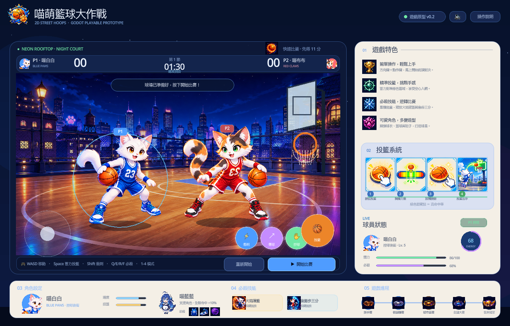

# 喵萌籃球大作戰

一款使用 Godot 4 製作的可玩 2D 街頭籃球遊戲原型。玩家操控喵白白，在霓虹屋頂球場迎戰 AI 對手喵布布。



## 遊戲內容

- WASD／方向鍵移動，Shift 衝刺
- 按住 Space 蓄力，放開後投籃
- 兩分球、三分球、籃板與球權切換
- 抄球、假傳變向與 AI 進攻
- Q／E／R／F 四種必殺技能
- 快速比賽、故事模式、挑戰模式與 Boss 挑戰
- 支援滑鼠與觸控操作
- 完整比分、時間、能量、體力、結算與重賽流程

## 執行方式

需要 Godot 4.7 或相容的 Godot 4 版本。

```bash
godot --path .
```

也可以在 Godot 編輯器中開啟 `project.godot`，再執行主場景。

## 專案結構

- `scripts/main.gd`：遊戲邏輯、AI、輸入與介面繪製
- `main.tscn`：主場景
- `assets/`：角色、球場、技能與介面生成素材
- `artifacts/basketball-final-game.png`：最新遊戲預覽
- `index.html`、`game.js`、`styles.css`：瀏覽器版可玩原型（載入與 Godot 版共用的生成夜景與角色 PNG，並保留離線向量 fallback）
